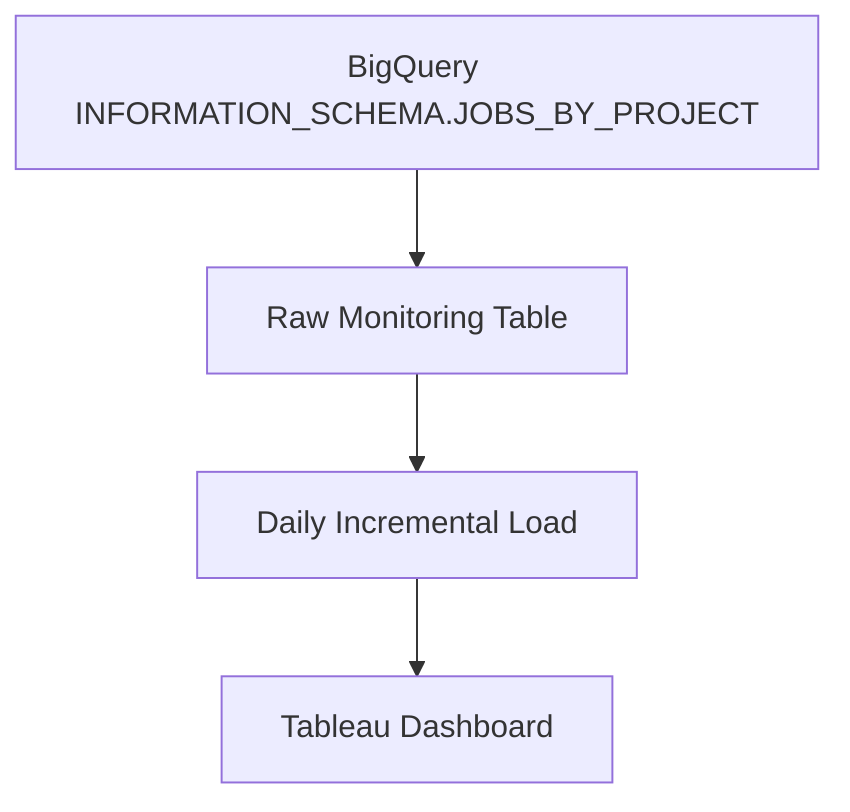
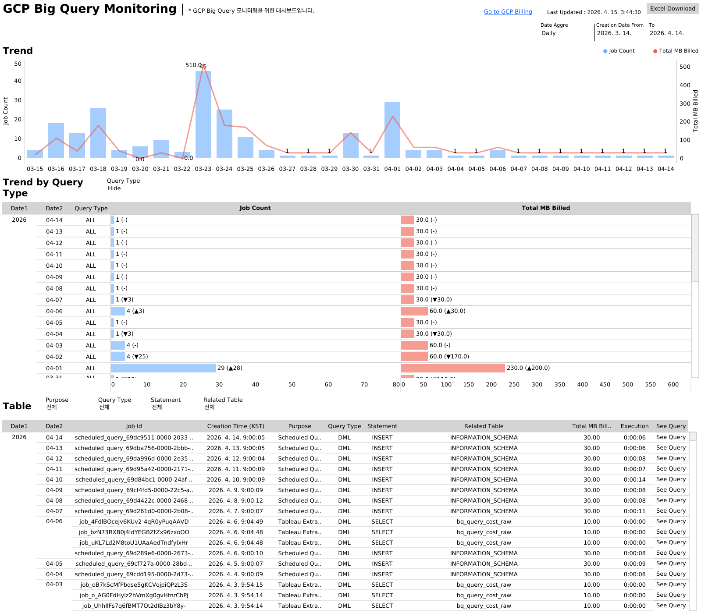

# BigQuery Monitoring Dashboard

A portfolio project that transforms **BigQuery job metadata** into a practical monitoring product for **cost governance**, **usage visibility**, and **query performance analysis**.

This project extracts query job information from BigQuery `INFORMATION_SCHEMA`, stores it in a historical monitoring table with a **daily incremental load**, and visualizes the results in **Tableau**.

---

## Overview

As BigQuery usage grows, it becomes increasingly difficult to understand:

- who is driving query cost
- which workloads process the most data
- how query activity changes over time
- where optimization opportunities exist
- how to monitor usage without manually checking the GCP console every time

To address this, I built a lightweight monitoring pipeline that captures BigQuery query job metadata on a daily basis and turns it into a dashboard-ready dataset for continuous analysis.

This project is designed to make BigQuery usage:

- **Visible** through centralized historical data
- **Measurable** through usage, cost, and performance metrics
- **Actionable** through dashboard-driven monitoring and analysis

---

## Background

In many analytics environments, BigQuery is used by multiple users for ad hoc analysis, dashboard refreshes, scheduled queries, and exploratory workloads. While this flexibility is powerful, it also creates a common operational problem: usage becomes easy to generate but difficult to govern.

The GCP console provides job-level metadata, but it is not ideal for long-term trend analysis, stakeholder reporting, or recurring operational monitoring. There is often no simple way to answer questions such as:

- Which users are generating the highest billed volume?
- Which queries are repeatedly expensive?
- How is overall BigQuery usage trending over time?
- Which workloads are slow or potentially inefficient?
- Where should optimization efforts be prioritized?

This project was built to solve that gap.

By extracting query job metadata from `INFORMATION_SCHEMA.JOBS_BY_PROJECT`, storing it historically, and visualizing it in Tableau, this dashboard creates a reusable monitoring layer for BigQuery operations. Instead of checking query history manually, users can monitor performance and cost patterns through a structured BI workflow.

From a business and analytics perspective, this supports:

- **Cost monitoring** by tracking billed and processed volume
- **Performance monitoring** through execution time and slot usage
- **User-level visibility** across projects and workloads
- **Optimization analysis** for repeated or heavy queries
- **Governance readiness** through historical monitoring data

In short, this project turns raw BigQuery metadata into an operational analytics product.

---

## Project Goal

The goal of this project is to build a simple but scalable monitoring layer that answers questions such as:

- How much BigQuery usage is occurring each day?
- Which users or projects generate the highest query cost?
- Which queries process the most data?
- Which workloads take the longest to run?
- How does usage evolve over time?

---

## End-to-End Process

```text
Create Table -> Incremental Load (Daily) -> Tableau Dashboard
```

### Pipeline Flow

1. **Create a raw monitoring table**

   * Extract query metadata from `INFORMATION_SCHEMA.JOBS_BY_PROJECT`
   * Store execution, usage, and cost-related fields in BigQuery

2. **Run a daily incremental load**

   * Insert the previous day's completed query jobs
   * Preserve history for trend analysis and monitoring

3. **Build a Tableau dashboard**

   * Connect Tableau to the monitoring table
   * Visualize usage trends, cost signals, and query-level details

---

## Architecture



---

## Key Features

* Historical monitoring of BigQuery query jobs
* Daily incremental load using Scheduled Query
* Partitioned and clustered table design for efficient analysis
* Query cost and performance tracking
* Tableau-based visualization for monitoring and governance
* Reusable structure for portfolio, internal BI, or ops dashboards

---

## Data Source

This project uses the following metadata source:

* `region-asia-northeast3.INFORMATION_SCHEMA.JOBS_BY_PROJECT`

The source contains BigQuery job execution metadata for the specified region.

---

## Data Model

### Main Table

* `project-7fa653f6-d7a3-40a0-893.gcp_monitoring.bq_query_cost_raw`

### Core Fields

* `creation_time_utc`
* `project_id`
* `user_email`
* `job_id`
* `start_time`
* `end_time`
* `execution_ms`
* `query`
* `total_bytes_billed`
* `total_bytes_processed`
* `total_slot_ms`
* `processed_tb`
* `billed_tb`
* `snapshot_timestamp`

### Table Design

* **Partitioned by** `DATE(creation_time_utc)`
* **Clustered by** `user_email`, `project_id`

This structure helps improve query performance and makes downstream dashboard filtering more efficient.

---

## SQL Scripts

### 1) Create Table Statement

```sql
-- Last Updated: 2026-03-25
CREATE OR REPLACE TABLE `project-7fa653f6-d7a3-40a0-893.gcp_monitoring.bq_query_cost_raw`
PARTITION BY DATE(creation_time_utc)
CLUSTER BY user_email, project_id
AS
SELECT
  creation_time AS creation_time_utc,
  project_id,
  user_email,
  job_id,
  start_time,
  end_time,
  TIMESTAMP_DIFF(end_time, start_time, MILLISECOND) AS execution_ms,
  query,
  total_bytes_billed,
  total_bytes_processed,
  total_slot_ms,
  total_bytes_processed / POW(1024, 4) AS processed_tb,
  total_bytes_billed / POW(1024, 4) AS billed_tb,
  CURRENT_TIMESTAMP() AS snapshot_timestamp
FROM `region-asia-northeast3`.INFORMATION_SCHEMA.JOBS_BY_PROJECT
WHERE job_type = 'QUERY'
  AND state = 'DONE';
```

### 2) Incremental Load Statement

```sql
-- Scheduled Query (Incremental Load)
-- Runs daily at 00:00 UTC
INSERT INTO `project-7fa653f6-d7a3-40a0-893.gcp_monitoring.bq_query_cost_raw`
SELECT
  creation_time AS creation_time_utc,
  project_id,
  user_email,
  job_id,
  start_time,
  end_time,
  TIMESTAMP_DIFF(end_time, start_time, MILLISECOND) AS execution_ms,
  query,
  total_bytes_billed,
  total_bytes_processed,
  total_slot_ms,
  total_bytes_processed / POW(1024, 4) AS processed_tb,
  total_bytes_billed / POW(1024, 4) AS billed_tb,
  CURRENT_TIMESTAMP() AS snapshot_timestamp
FROM `region-asia-northeast3`.INFORMATION_SCHEMA.JOBS_BY_PROJECT
WHERE job_type = 'QUERY'
  AND state = 'DONE'
  AND DATE(creation_time) = DATE_SUB(CURRENT_DATE(), INTERVAL 1 DAY);
```

---

## Dashboard Design

The Tableau dashboard is intended to support both **high-level monitoring** and **query-level investigation**.

### Recommended Views

#### 1. Usage Trend

* Daily query count
* Daily processed TB
* Daily billed TB
* Usage trend over time

#### 2. User Monitoring

* Top users by billed volume
* Top users by processed volume
* Query count by user
* User-level workload distribution

#### 3. Query Performance

* Long-running queries
* Queries with high slot consumption
* Queries with large processed volume
* Execution time trend

#### 4. Query Detail Analysis

* Query text
* Job ID
* User email
* Processed TB
* Billed TB
* Execution time
* Time of execution

---

## Example Business Questions Answered

This dashboard helps answer questions such as:

* Who are the top BigQuery users by cost?
* Which queries are the most resource-intensive?
* Which days show unusual usage spikes?
* Are there recurring heavy workloads that should be optimized?
* How does cost trend change over time?
* Which users are driving the majority of billed volume?

---

## Repository Structure

```text
.
├── README.md
├── sql
│   ├── create_table.sql
│   └── incremental_load.sql
├── tableau
│   ├── workbook.twb
│   └── screenshots
│       ├── dashboard_overview.png
│       ├── usage_trend.png
│       └── query_detail.png
└── docs
    └── architecture.png
```

---

## How to Use

### Step 1. Create the monitoring table

Run the **Create Table Statement** in BigQuery.

### Step 2. Configure a Scheduled Query

Set up a scheduled query to run the **Incremental Load Statement** daily.

### Step 3. Connect Tableau

Use Tableau to connect to the monitoring table and build dashboard views for usage, cost, and performance analysis.

---

## Why This Project Matters

This project goes beyond a simple SQL script or dashboard.
It demonstrates how to turn platform metadata into a reusable BI monitoring product.

It combines:

* **Data engineering thinking** for ingestion and historical storage
* **Analytical design** for defining meaningful monitoring metrics
* **BI dashboard design** for communicating operational insights
* **Governance perspective** for tracking usage and cost systematically

This makes it a practical portfolio project for analytics engineering, BI, data platform monitoring, and cost governance use cases.

---

## Notes

* This project monitors completed query jobs only (`state = 'DONE'`).
* The metadata source is region-specific (`asia-northeast3`).
* Query text availability may vary depending on permissions and governance settings.
* Historical storage enables longer-term trend analysis than the default operational view.
* A deduplication or `MERGE` strategy can be added later if stronger incremental control is required.

---

## Potential Enhancements

Future improvements may include:

* adding a curated mart layer on top of the raw table
* classifying workloads by query pattern or user group
* estimating cost in currency based on billed volume
* introducing `MERGE`-based incremental logic
* adding alerting for abnormal query spikes
* integrating with Looker Studio or other BI tools
* creating workload tags for dashboard vs. ad hoc usage

---

## Dashboard Preview




---

## Tech Stack

* **Google BigQuery**
  * **BigQuery INFORMATION_SCHEMA**
  * **Scheduled Query**
* **Tableau**

---

## Author

**Jongjun Lim**
Data Analyst | BI Consultant

This project was built as a portfolio of BigQuery monitoring, dashboard design, and usage governance.